# HRManagement
 

  

Một dự án của bộ môn PRJ301 của sinh viên Trần Thùy Trang với sự chỉ dẫn của giảng viên Trần Quý Ban

## Giới thiệu
Repository này là một trang mạng tạo ra cho học sinh trường Quốc học Vinh- THPT Huỳnh Thúc Kháng. Mục tiêu của trang web này là tạo ra một trang web nơi mà giáo viên và học sinh cùng có thể quản lý các bài tập mà mình nộp và xem báo cáo điểm một cách tự động.

## Mục tiêu của dự án
 - giúp giáo viên/ quản lý có thể quản lý bài tập của học sinh một cách hiệu quả
 - giúp học sinh nắm bắt được bài tập mình cần làm và giao nộp
 - giáo viên có thể đưa ra các nhận xét và chấm bài của học sinh
## Ảnh chụp màn hình

| | | |
|:-------------------------:|:-------------------------:|:-------------------------:|
|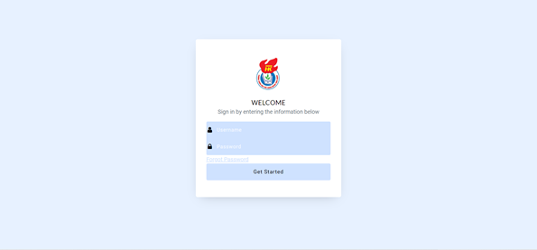|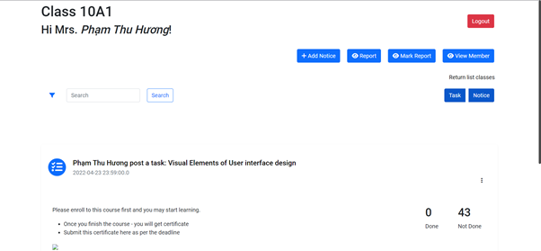|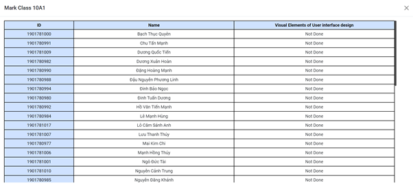|
|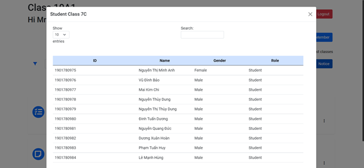|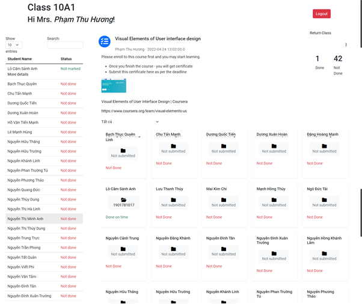|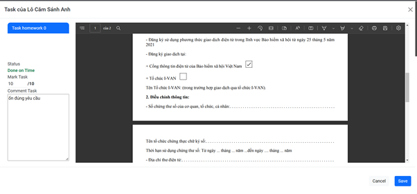|
|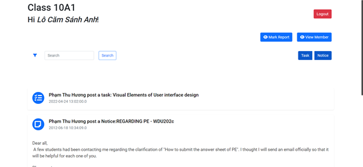|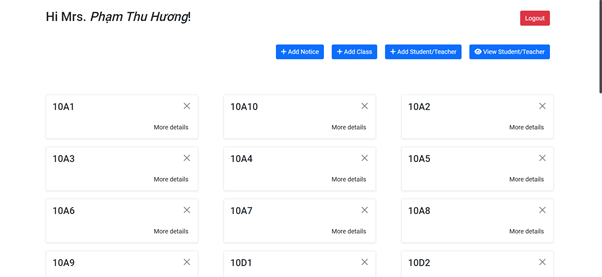|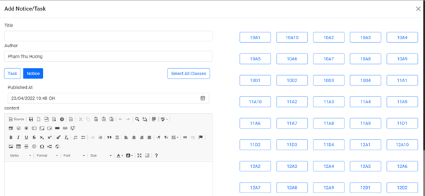|
|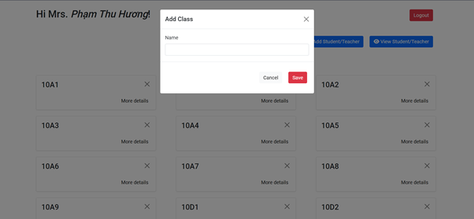|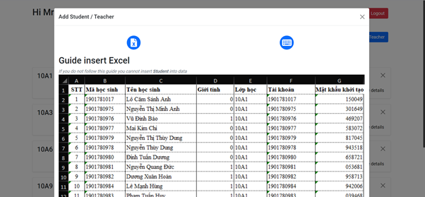|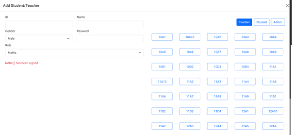|
|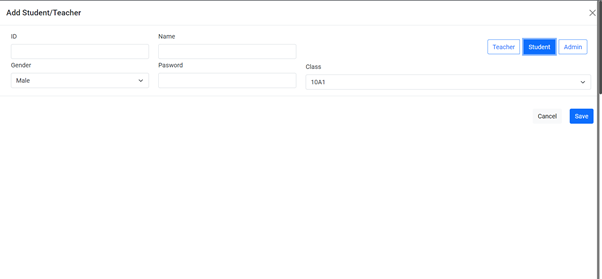|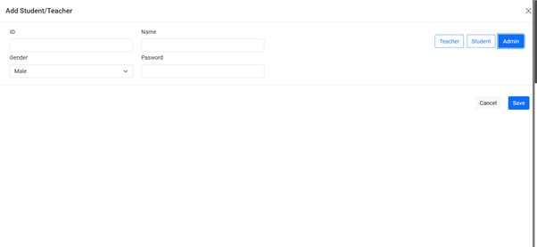|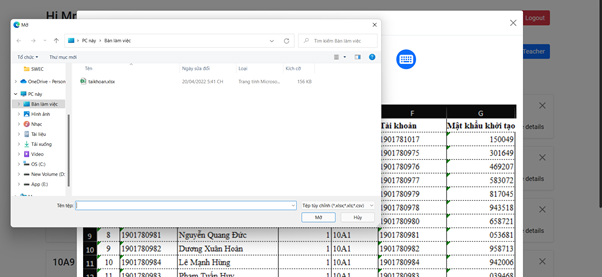|
|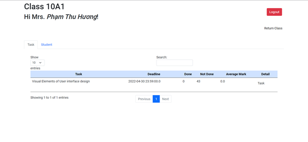|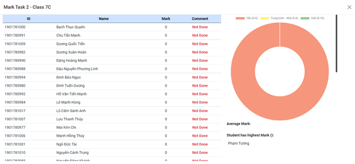|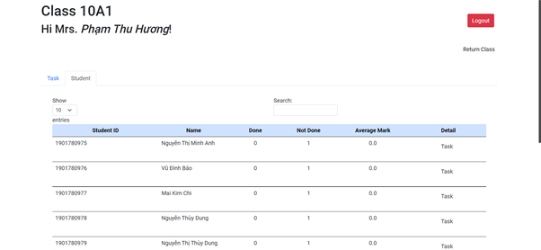|
|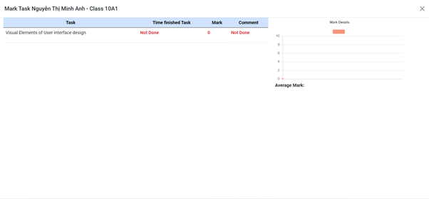|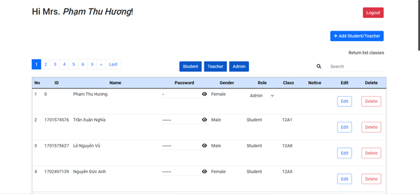|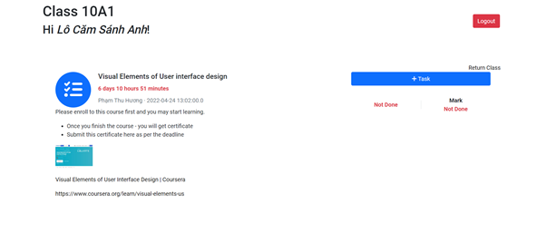|
||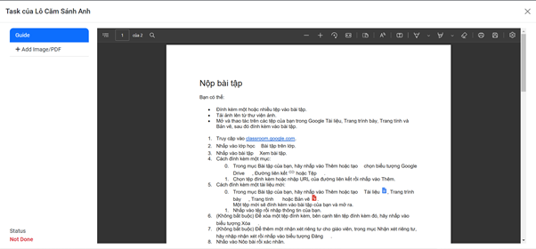|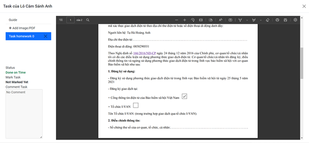|
|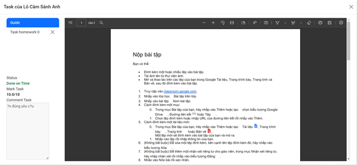|

## Người đóng góp
Trần Thùy Trang  
<a href="https://github.com/trantrang2101">@trantrang2101</a>

<a href="https://www.facebook.com/thuytrang.tuyetvan/">https://www.facebook.com/thuytrang.tuyetvan/</a> 

## Giấy phép

Copyright (c) <a href="https://github.com/trantrang2101">@trantrang2101</a> 2022. Bảo lưu mọi quyền  
Được cấp phép theo giấy phép <a href="https://github.com/trantrang2101/HRManagement/blob/main/LICENSE.txt">MIT</a>.